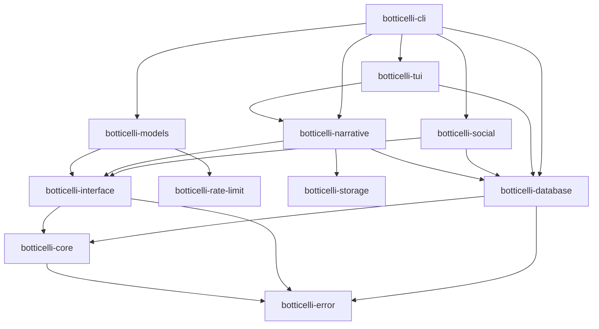

# Workspace Migration Plan

## Executive Summary

This document outlines a strategy for migrating the Boticelli monorepo into a Cargo workspace with multiple independent crates. The current architecture already uses traits, feature flags, and clear module boundaries, making it well-suited for workspace migration.

**Goals:**
- **Independent crates** - Each major subsystem becomes its own publishable crate
- **Clear dependencies** - Explicit dependency relationships between crates
- **Flexible builds** - Users can depend on only what they need
- **Maintainability** - Easier to test, version, and maintain individual components
- **Backward compatibility** - Existing code continues to work via re-exports
- **Proper naming** - Embrace the Botticelli (artist) connection with correct spelling

---

## Name Change Strategy: boticelli → Botticelli

**Rationale:** The current spelling "boticelli" (one 't') was intended to differentiate from the Renaissance artist Sandro Botticelli. However, we've decided to lean into the connection and adopt the correct historical spelling "Botticelli" (two 't's) throughout the project.

**Scope:** This is a comprehensive rename affecting:
- Repository name (GitHub)
- All crate names in the workspace
- All code (types, traits, functions, variables)
- All documentation files
- Configuration files
- File paths and directories
- Database schema (carefully - see migration notes)

### Rename Checklist

#### 1. Repository & GitHub (First Step)

**Actions:**
1. Rename GitHub repository: `crumplecup/boticelli` → `crumplecup/botticelli`
   - Settings → Repository name → Rename
   - GitHub automatically creates redirect from old URL
   - Update local remote: `git remote set-url origin git@github.com:crumplecup/botticelli.git`

2. Update repository metadata:
   - Repository description
   - Topics/tags
   - About section

**Impact:** Low risk - GitHub handles redirects, existing clones continue working

#### 2. Workspace & Crate Names

**Pattern:** `botticelli-*` → `botticelli-*`

```toml
# Before
[workspace]
members = [
    "crates/boticelli-error",
    "crates/boticelli-core",
    ...
]

# After
[workspace]
members = [
    "crates/botticelli-error",
    "crates/botticelli-core",
    ...
]
```

**Affected crates:**
- `botticelli-error` → `botticelli-error`
- `botticelli-core` → `botticelli-core`
- `botticelli-interface` → `botticelli-interface`
- `botticelli-rate-limit` → `botticelli-rate-limit`
- `botticelli-storage` → `botticelli-storage`
- `botticelli-models` → `botticelli-models`
- `botticelli-database` → `botticelli-database`
- `botticelli-narrative` → `botticelli-narrative`
- `botticelli-social` → `botticelli-social`
- `botticelli-tui` → `botticelli-tui`
- `botticelli-cli` → `botticelli-cli`
- `boticelli` → `botticelli` (main facade crate)

#### 3. Directory Structure

**Rename operations:**
```bash
# Workspace root (can stay as-is or rename)
mv boticelli botticelli  # Optional: rename directory

# Within workspace
mv crates/boticelli-error crates/botticelli-error
mv crates/boticelli-core crates/botticelli-core
mv crates/boticelli-interface crates/botticelli-interface
# ... etc for all crates
mv crates/boticelli crates/botticelli
```

**Configuration files:**
- `boticelli.toml` → `botticelli.toml`
- References in `.gitignore`, `diesel.toml`, etc.

#### 4. Code Changes

**Type names:**
```rust
// Before
pub struct BoticelliDriver;
pub struct BoticelliError;
pub struct BoticelliConfig;
pub type BoticelliResult<T> = Result<T, BoticelliError>;

// After
pub struct BotticelliDriver;
pub struct BotticelliError;
pub struct BotticelliConfig;
pub type BotticelliResult<T> = Result<T, BotticelliError>;
```

**Trait names:**
```rust
// Before
pub trait BoticelliDriver { ... }

// After
pub trait BotticelliDriver { ... }
```

**Import statements:**
```rust
// Before
use boticelli::{BoticelliDriver, BoticelliConfig};
use boticelli_core::{Input, Output};

// After
use botticelli::{BotticelliDriver, BotticelliConfig};
use botticelli_core::{Input, Output};
```

**String literals:**
```rust
// Before
fn provider_name(&self) -> &'static str { "boticelli" }
const CONFIG_FILE: &str = "boticelli.toml";

// After
fn provider_name(&self) -> &'static str { "botticelli" }
const CONFIG_FILE: &str = "botticelli.toml";
```

#### 5. Documentation Files

**Markdown files to update:**
- `README.md` - All references to project name
- `CLAUDE.md` - Examples and documentation
- `ERROR_RECOVERY.md`
- `GEMINI.md`, `GEMINI_STREAMING.md`
- `DISCORD_*.md`
- `NARRATIVE_PROCESSORS.md`
- `CONTENT_GENERATION.md`
- `TUI_GUIDE.md`, `TUI_TROUBLESHOOTING.md`
- `MEDIA_STORAGE.md`
- `SCHEMA_INFERENCE.md`
- `SOCIAL_MEDIA.md`
- `WORKSPACE_MIGRATION.md` (this file)

**Search patterns:**
```bash
# Find all occurrences (case-insensitive)
rg -i "boticelli" --type md

# Find exact case matches
rg "boticelli" --type md      # lowercase (most common)
rg "Boticelli" --type md      # capitalized (some docs)
rg "BOTICELLI" --type md      # uppercase (rare)
```

#### 6. Configuration Files

**Files to update:**
- `Cargo.toml` (workspace and all crate manifests)
  - Package names
  - Dependency references
  - Binary names
  - Repository URLs
  - Keywords, categories
- `boticelli.toml` → `botticelli.toml`
  - Rename file
  - Update internal references
- `diesel.toml` - Database config paths
- `justfile` - Build commands and paths
- `.github/workflows/*.yml` - CI/CD configuration

#### 7. Database Considerations

**Schema tables:** Database table names typically should NOT change to avoid migration complexity.

**Approach:**
- Keep existing table names as-is (e.g., `narratives`, `act_executions`)
- Only rename if table names explicitly contain "boticelli" (unlikely)
- Document any database-level names that differ from code names

**Migration strategy (if needed):**
```sql
-- Only if tables explicitly named with old spelling
ALTER TABLE boticelli_metadata RENAME TO botticelli_metadata;
```

**Risk mitigation:**
- Keep table names generic (already done: `narratives`, not `boticelli_narratives`)
- Document in code that DB names may differ from crate names
- No breaking changes for existing databases

#### 8. File Paths & Directories

**Paths that reference the project:**
```bash
# Default config directory
~/.config/botticelli/     → ~/.config/botticelli/
~/.local/share/botticelli/ → ~/.local/share/botticelli/

# Storage directories (if hardcoded)
./storage/botticelli/     → ./storage/botticelli/
```

**Migration support:**
- Check both old and new paths
- Create symlinks for backwards compatibility (optional)
- Document migration in release notes

### Integration with Workspace Migration

**Recommended approach:** Combine rename with workspace migration for efficiency.

**Timeline:**
1. **Phase 0 (Pre-migration): Repository Rename** (1 day)
   - Rename GitHub repository
   - Update local git remotes
   - Update all documentation files
   - Commit and push as single "Rename project to Botticelli" commit

2. **Phase 1-10: Workspace Migration with New Names** (3-4 weeks)
   - Create workspace with `botticelli-*` crate names (not `botticelli-*`)
   - Move code into properly named crates
   - All new code uses `Botticelli*` naming

**Benefit:** Do the rename once during migration, not twice.

### Automated Rename Tools

**Use `cargo-workspace` or scripts:**

```bash
#!/bin/bash
# rename_project.sh

# 1. Rename all crate directories
for dir in crates/boticelli-*; do
  new_dir="${dir/botticelli/botticelli}"
  git mv "$dir" "$new_dir"
done

# 2. Update Cargo.toml files
find . -name "Cargo.toml" -exec sed -i 's/botticelli/botticelli/g' {} +

# 3. Update Rust source files
find src -name "*.rs" -exec sed -i 's/Boticelli/Botticelli/g' {} +
find src -name "*.rs" -exec sed -i 's/botticelli/botticelli/g' {} +

# 4. Update documentation
find . -name "*.md" -exec sed -i 's/botticelli/botticelli/g' {} +
find . -name "*.md" -exec sed -i 's/Boticelli/Botticelli/g' {} +

# 5. Rename config file
git mv boticelli.toml botticelli.toml

# 6. Update test files
find tests -name "*.rs" -exec sed -i 's/botticelli/botticelli/g' {} +
```

**Important:** Test thoroughly after automated rename!

### Testing After Rename

**Verification checklist:**
```bash
# 1. Clean build
cargo clean
cargo build --all-features

# 2. Run all tests
cargo test --all-features

# 3. Run clippy
cargo clippy --all-features --all-targets

# 4. Check documentation builds
cargo doc --all-features --no-deps

# 5. Verify binary names
cargo build --release --bins
ls target/release/

# 6. Test CLI
./target/release/botticelli --help  # Not 'boticelli'

# 7. Check config loading
# Ensure it looks for botticelli.toml, not boticelli.toml
```

### Breaking Changes & Migration Guide

**For users upgrading from 0.1.x → 0.2.0:**

```markdown
## Breaking Changes in 0.2.0

### Project Renamed to Botticelli (Two T's)

The project has been renamed from "Boticelli" to "Botticelli" to properly honor
the Renaissance artist Sandro Botticelli.

**Cargo.toml changes:**
```toml
# Before (0.1.x)
[dependencies]
boticelli = "0.1"

# After (0.2.x)
[dependencies]
botticelli = "0.2"
```

**Import changes:**
```rust
// Before (0.1.x)
use boticelli::{BoticelliDriver, BoticelliConfig};

// After (0.2.x)
use botticelli::{BotticelliDriver, BotticelliConfig};
```

**Config file:**
- Rename `boticelli.toml` → `botticelli.toml`
- Update config directory: `~/.config/botticelli/` → `~/.config/botticelli/`

**No database changes required** - database schema is unaffected.
```

### Risks & Mitigation

**Risk 1: Typos during bulk rename**
- **Mitigation:** Use automated tools, then manual review
- **Test:** Comprehensive test suite after rename

**Risk 2: Missed references**
- **Mitigation:** Use `rg "boticelli"` to find all occurrences
- **Test:** Search for old spelling in build artifacts

**Risk 3: User confusion**
- **Mitigation:** Clear migration guide in release notes
- **Communication:** Blog post explaining the rename

**Risk 4: Broken external links**
- **Mitigation:** GitHub redirect handles old repo URLs
- **Documentation:** Update links in README badges, etc.

**Risk 5: Database incompatibility**
- **Mitigation:** Keep DB schema unchanged
- **Test:** Verify existing databases work with new code

### Success Criteria

✅ **Repository:**
- GitHub repo renamed to `botticelli`
- All GitHub metadata updated

✅ **Code:**
- All crate names use `botticelli-*` pattern
- All types/traits use `Botticelli*` naming
- All imports use new spelling
- Zero references to old spelling in code

✅ **Documentation:**
- All `.md` files updated
- README reflects new name
- Migration guide published

✅ **Functionality:**
- All tests pass with new names
- Binary named `botticelli` (not `boticelli`)
- Config file is `botticelli.toml`

✅ **Publishing:**
- Crates published to crates.io with new names
- Old crates marked as deprecated with migration notice

---

## Current Architecture Analysis

### Module Structure (8,557 LOC)

```
botticelli/
├── src/
│   ├── core.rs              # Core types and traits (~200 LOC)
│   ├── error.rs             # Error types (~300 LOC)
│   ├── interface.rs         # BotticelliDriver trait (~150 LOC)
│   ├── models/              # LLM provider integrations (~1800 LOC)
│   │   └── gemini/          # Gemini client, Live API, errors
│   ├── narrative/           # Narrative system (~1500 LOC)
│   │   ├── core.rs          # Narrative types
│   │   ├── executor.rs      # Execution engine
│   │   ├── processor.rs     # Act processors
│   │   ├── repository.rs    # Storage abstraction
│   │   └── content_generation.rs
│   ├── rate_limit/          # Rate limiting (~800 LOC)
│   │   ├── limiter.rs       # RateLimiter<T>
│   │   ├── tiers.rs         # Tier trait + implementations
│   │   └── retry.rs         # RetryableError trait
│   ├── database/            # PostgreSQL integration (~2000 LOC)
│   │   ├── models.rs        # DB models
│   │   ├── schema.rs        # Diesel schema
│   │   ├── schema_reflection.rs
│   │   ├── schema_inference.rs
│   │   ├── narrative_repository.rs
│   │   └── content_management.rs
│   ├── storage/             # Content-addressable storage (~400 LOC)
│   │   └── filesystem.rs
│   ├── social/              # Social platform integrations (~1000 LOC)
│   │   └── discord/
│   ├── tui/                 # Terminal UI (~600 LOC)
│   └── cli.rs               # CLI parsing (~400 LOC)
```

### Dependency Relationships



### Feature Flags

- `gemini`, `anthropic`, `huggingface`, `groq`, `perplexity` - LLM providers
- `database` - PostgreSQL support
- `discord` - Discord integration
- `tui` - Terminal UI
- `api` - API testing marker

---

## Proposed Workspace Structure

### Phase 1: Core Foundation Crates

Create the foundation that other crates depend on:

#### 1. `botticelli-error`
**Purpose:** Error types and trait definitions  
**Dependencies:** None (foundation crate)  
**Exports:**
- `BoticelliError` / `BoticelliErrorKind`
- `BoticelliResult<T>`
- Core error conversion traits

**Why first:** Zero dependencies, needed by everything

#### 2. `botticelli-core`
**Purpose:** Core types, traits, and abstractions  
**Dependencies:** `botticelli-error`  
**Exports:**
- `Input` / `Output` enums
- `Message` / `MessageRole`
- `GenerateRequest` / `GenerateResponse`
- Common serialization types

**Why second:** Foundation types, minimal dependencies

#### 3. `botticelli-interface`
**Purpose:** The `BoticelliDriver` trait  
**Dependencies:** `botticelli-core`, `botticelli-error`  
**Exports:**
- `BoticelliDriver` trait
- Integration test utilities

**Why third:** Defines the contract all providers implement

---

### Phase 2: Rate Limiting & Retry

#### 4. `botticelli-rate-limit`
**Purpose:** Rate limiting and error recovery  
**Dependencies:** 
- `botticelli-error`
- External: `governor`, `tokio`, `tokio-retry2`, `tracing`

**Exports:**
- `RateLimiter<T>`
- `Tier` trait + implementations (`GeminiTier`, `OpenAITier`, `AnthropicTier`)
- `TieredProvider<T>` + implementations
- `RetryableError` trait
- Retry strategies

**Features:** None (always included when used)

---

### Phase 3: Provider Implementations

#### 5. `botticelli-models`
**Purpose:** LLM provider integrations  
**Dependencies:**
- `botticelli-interface`
- `botticelli-rate-limit`
- `botticelli-error`
- External: `reqwest`, `serde`, `tokio`, `tracing`

**Features:**
- `gemini` (default off) - Adds `gemini-rust`, Gemini client
- `anthropic` (default off) - Adds `anthropic-sdk`
- `huggingface` (default off) - Adds `huggingface_inference_rs`
- `groq` (default off) - Adds `groqai`
- `perplexity` (default off) - Adds `perplexity`

**Exports per feature:**
- `GeminiClient` (gemini)
- `GeminiLiveClient` (gemini)
- `GeminiError` / `GeminiResult` (gemini)
- Similar for each provider

**Why independent:** Each provider is optional, heavy dependencies

---

### Phase 4: Storage & Database

#### 6. `botticelli-storage`
**Purpose:** Content-addressable storage  
**Dependencies:**
- `botticelli-error`
- External: `sha2`, `tokio`, `serde`

**Exports:**
- `Storage` trait
- `FilesystemStorage` implementation
- Content hashing utilities

**Features:** None

#### 7. `botticelli-database`
**Purpose:** PostgreSQL integration  
**Dependencies:**
- `botticelli-core`
- `botticelli-error`
- External: `diesel`, `chrono`, `uuid`

**Features:**
- `postgres` (default on) - Core database functionality

**Exports:**
- Schema definitions
- Repository traits and implementations
- Schema reflection utilities
- Schema inference
- Content generation models

**Why separate:** Heavy dependency (diesel), optional for some users

---

### Phase 5: Narrative System

#### 8. `botticelli-narrative`
**Purpose:** Narrative execution engine  
**Dependencies:**
- `botticelli-interface`
- `botticelli-storage`
- `botticelli-error`
- Optional: `botticelli-database`

**Features:**
- `database` (default off) - Database persistence
- `content-generation` (default on) - Content generation processor

**Exports:**
- `Narrative` / `NarrativeMetadata` / `Act`
- `NarrativeRepository` trait
- `InMemoryNarrativeRepository`
- `PostgresNarrativeRepository` (with database feature)
- `NarrativeExecutor`
- `ActProcessor` trait
- `ContentGenerationProcessor` (with database feature)
- TOML parsing utilities

---

### Phase 6: Integration Layers

#### 9. `botticelli-social`
**Purpose:** Social platform integrations  
**Dependencies:**
- `botticelli-interface`
- `botticelli-database`
- External: Platform SDKs

**Features:**
- `discord` (default off) - Adds `serenity`

**Exports:**
- `DiscordDriver` (discord)
- Discord models and conversions (discord)

**Why separate:** Heavy platform dependencies, optional

#### 10. `botticelli-tui`
**Purpose:** Terminal UI for content review  
**Dependencies:**
- `botticelli-database`
- `botticelli-narrative`
- External: `ratatui`, `crossterm`

**Features:** None (TUI or nothing)

**Exports:**
- `run_tui()`
- `App` / `AppMode`
- `TuiError` / `TuiErrorKind`

**Why separate:** Heavy UI dependencies, optional tool

#### 11. `botticelli-cli`
**Purpose:** Command-line interface  
**Dependencies:**
- `botticelli-models`
- `botticelli-narrative`
- `botticelli-database`
- `botticelli-social`
- `botticelli-tui`
- External: `clap`

**Features:** Inherits from dependencies

**Exports:**
- `Cli` struct
- `Commands` enum
- CLI parsing utilities

---

### Phase 7: Unified Facade

#### 12. `boticelli` (main crate)
**Purpose:** Re-export facade for backward compatibility  
**Dependencies:** All workspace crates  
**Features:** All features from workspace crates

**Cargo.toml:**
```toml
[package]
name = "boticelli"
version = "0.2.0"
edition = "2024"

[dependencies]
boticelli-error = { path = "../boticelli-error", version = "0.2.0" }
boticelli-core = { path = "../boticelli-core", version = "0.2.0" }
boticelli-interface = { path = "../boticelli-interface", version = "0.2.0" }
boticelli-rate-limit = { path = "../boticelli-rate-limit", version = "0.2.0" }
boticelli-storage = { path = "../boticelli-storage", version = "0.2.0" }
boticelli-models = { path = "../boticelli-models", version = "0.2.0", optional = true }
boticelli-database = { path = "../boticelli-database", version = "0.2.0", optional = true }
boticelli-narrative = { path = "../boticelli-narrative", version = "0.2.0" }
boticelli-social = { path = "../boticelli-social", version = "0.2.0", optional = true }
boticelli-tui = { path = "../boticelli-tui", version = "0.2.0", optional = true }
boticelli-cli = { path = "../boticelli-cli", version = "0.2.0", optional = true }

[features]
default = []
gemini = ["boticelli-models/gemini"]
anthropic = ["boticelli-models/anthropic"]
database = ["boticelli-database", "boticelli-narrative/database"]
discord = ["boticelli-social/discord"]
tui = ["boticelli-tui"]
cli = ["boticelli-cli"]
```

**lib.rs:**
```rust
// Re-export everything from workspace crates
pub use boticelli_error::*;
pub use boticelli_core::*;
pub use boticelli_interface::*;
pub use boticelli_rate_limit::*;
pub use boticelli_storage::*;
pub use boticelli_narrative::*;

#[cfg(feature = "models")]
pub use boticelli_models::*;

#[cfg(feature = "database")]
pub use boticelli_database::*;

#[cfg(feature = "social")]
pub use boticelli_social::*;

#[cfg(feature = "tui")]
pub use boticelli_tui::*;

#[cfg(feature = "cli")]
pub use boticelli_cli::*;
```

**Why:** Existing users see no breaking changes

---

## Directory Structure

```
botticelli/
├── Cargo.toml                    # Workspace manifest
├── README.md
├── LICENSE-MIT
├── LICENSE-APACHE
│
├── crates/
│   ├── botticelli/                # Main facade crate
│   │   ├── Cargo.toml
│   │   ├── src/
│   │   │   └── lib.rs            # Re-exports
│   │   └── README.md
│   │
│   ├── boticelli-error/          # Foundation: Error types
│   │   ├── Cargo.toml
│   │   └── src/
│   │       └── lib.rs
│   │
│   ├── boticelli-core/           # Foundation: Core types
│   │   ├── Cargo.toml
│   │   └── src/
│   │       └── lib.rs
│   │
│   ├── boticelli-interface/      # Foundation: BoticelliDriver
│   │   ├── Cargo.toml
│   │   └── src/
│   │       └── lib.rs
│   │
│   ├── boticelli-rate-limit/     # Rate limiting + retry
│   │   ├── Cargo.toml
│   │   └── src/
│   │       ├── lib.rs
│   │       ├── limiter.rs
│   │       ├── tiers.rs
│   │       └── retry.rs
│   │
│   ├── boticelli-models/         # LLM providers
│   │   ├── Cargo.toml
│   │   └── src/
│   │       ├── lib.rs
│   │       └── gemini/
│   │           ├── mod.rs
│   │           ├── client.rs
│   │           ├── live_client.rs
│   │           └── error.rs
│   │
│   ├── boticelli-storage/        # Content-addressable storage
│   │   ├── Cargo.toml
│   │   └── src/
│   │       ├── lib.rs
│   │       └── filesystem.rs
│   │
│   ├── boticelli-database/       # PostgreSQL integration
│   │   ├── Cargo.toml
│   │   └── src/
│   │       ├── lib.rs
│   │       ├── schema.rs
│   │       ├── models.rs
│   │       └── repositories/
│   │
│   ├── boticelli-narrative/      # Narrative system
│   │   ├── Cargo.toml
│   │   └── src/
│   │       ├── lib.rs
│   │       ├── core.rs
│   │       ├── executor.rs
│   │       └── processor.rs
│   │
│   ├── boticelli-social/         # Social platforms
│   │   ├── Cargo.toml
│   │   └── src/
│   │       ├── lib.rs
│   │       └── discord/
│   │
│   ├── boticelli-tui/            # Terminal UI
│   │   ├── Cargo.toml
│   │   └── src/
│   │       ├── lib.rs
│   │       ├── app.rs
│   │       └── ui.rs
│   │
│   └── boticelli-cli/            # CLI binary
│       ├── Cargo.toml
│       └── src/
│           ├── lib.rs            # CLI types
│           └── main.rs           # Binary entry
│
├── migrations/                   # Database migrations (shared)
├── narratives/                   # Example narratives
├── tests/                        # Integration tests
└── docs/                         # Documentation
```

---

## Workspace Cargo.toml

```toml
[workspace]
members = [
    "crates/boticelli-error",
    "crates/boticelli-core",
    "crates/boticelli-interface",
    "crates/boticelli-rate-limit",
    "crates/boticelli-storage",
    "crates/boticelli-models",
    "crates/boticelli-database",
    "crates/boticelli-narrative",
    "crates/boticelli-social",
    "crates/boticelli-tui",
    "crates/boticelli-cli",
    "crates/boticelli",
]
resolver = "2"

[workspace.package]
version = "0.2.0"
edition = "2024"
license = "MIT OR Apache-2.0"
authors = ["Erik Rose <erik.w.rose@gmail.com>"]
repository = "https://github.com/crumplecup/boticelli"
keywords = ["llm", "chatbot", "ai", "nlp", "api"]
categories = ["api-bindings", "asynchronous", "ai"]

[workspace.dependencies]
# Internal crates
boticelli-error = { path = "crates/boticelli-error", version = "0.2.0" }
boticelli-core = { path = "crates/boticelli-core", version = "0.2.0" }
boticelli-interface = { path = "crates/boticelli-interface", version = "0.2.0" }
boticelli-rate-limit = { path = "crates/boticelli-rate-limit", version = "0.2.0" }
boticelli-storage = { path = "crates/boticelli-storage", version = "0.2.0" }
boticelli-models = { path = "crates/boticelli-models", version = "0.2.0" }
boticelli-database = { path = "crates/boticelli-database", version = "0.2.0" }
boticelli-narrative = { path = "crates/boticelli-narrative", version = "0.2.0" }
boticelli-social = { path = "crates/boticelli-social", version = "0.2.0" }
boticelli-tui = { path = "crates/boticelli-tui", version = "0.2.0" }
boticelli-cli = { path = "crates/boticelli-cli", version = "0.2.0" }

# Common external dependencies (shared versions)
tokio = { version = "1", features = ["full"] }
reqwest = { version = "0.12", features = ["json", "gzip", "stream", "rustls-tls"] }
serde = { version = "1", features = ["derive"] }
serde_json = "1"
async-trait = "0.1"
tracing = "0.1"
tracing-subscriber = { version = "0.3", features = ["fmt", "env-filter"] }

# Rate limiting
governor = "0.10"
tokio-retry2 = { version = "0.6", features = ["jitter"] }

# Database
diesel = { version = "2.3", features = ["postgres", "chrono", "uuid", "serde_json", "64-column-tables"] }
diesel_migrations = "2.3"
chrono = { version = "0.4", features = ["serde"] }
uuid = { version = "1.18", features = ["v4", "serde"] }

# LLM SDKs
gemini-rust = "1.5"
anthropic-sdk = "0.1"
huggingface_inference_rs = "0.5"
groqai = "0.1"
perplexity = "0.1"

# Social platforms
serenity = { version = "0.12", default-features = false, features = ["client", "gateway", "rustls_backend", "model"] }

# TUI
ratatui = "0.29"
crossterm = "0.28"

# CLI
clap = { version = "4", features = ["derive", "env"] }
```

---

## Migration Strategy

### Phase-by-Phase Approach

#### Phase 0: Preparation (1-2 days)
1. **Audit dependencies** - Document all current dependencies and their usage
2. **Identify coupling** - Find tight coupling that needs refactoring
3. **Create migration branch** - `git checkout -b workspace-migration`
4. **Document current API** - Capture all public exports for compatibility testing

#### Phase 1: Foundation Crates (2-3 days)
1. Create workspace structure:
   ```bash
   mkdir -p crates/{boticelli-error,boticelli-core,boticelli-interface}
   ```

2. Create workspace `Cargo.toml`

3. **Migrate `botticelli-error`:**
   - Move `src/error.rs` → `crates/boticelli-error/src/lib.rs`
   - Create `crates/boticelli-error/Cargo.toml`
   - Test: `cargo build -p boticelli-error`

4. **Migrate `botticelli-core`:**
   - Move `src/core.rs` → `crates/boticelli-core/src/lib.rs`
   - Update imports to use `botticelli-error`
   - Test: `cargo build -p boticelli-core`

5. **Migrate `botticelli-interface`:**
   - Move `src/interface.rs` → `crates/boticelli-interface/src/lib.rs`
   - Update imports
   - Test: `cargo build -p boticelli-interface`

**Validation:** `cargo test --all-features` in workspace root

#### Phase 2: Rate Limiting (1 day)
1. Create `crates/boticelli-rate-limit/`
2. Move `src/rate_limit/*` → `crates/boticelli-rate-limit/src/`
3. Update `Cargo.toml` with dependencies
4. Fix imports to use `botticelli-error`
5. Test: `cargo test -p boticelli-rate-limit`

#### Phase 3: Storage (1 day)
1. Create `crates/boticelli-storage/`
2. Move `src/storage/*` → `crates/boticelli-storage/src/`
3. Update imports
4. Test: `cargo test -p boticelli-storage`

#### Phase 4: Models (2-3 days)
1. Create `crates/boticelli-models/`
2. Move `src/models/*` → `crates/boticelli-models/src/`
3. Set up feature flags for each provider
4. Update imports to use:
   - `botticelli-interface`
   - `botticelli-rate-limit`
   - `botticelli-error`
5. Test each feature:
   ```bash
   cargo test -p boticelli-models --features gemini
   cargo test -p boticelli-models --features anthropic
   ```

**Validation:** Ensure all provider tests pass

#### Phase 5: Database (2-3 days)
1. Create `crates/boticelli-database/`
2. Move `src/database/*` → `crates/boticelli-database/src/`
3. Move `migrations/` to workspace root (shared)
4. Update `diesel.toml` to point to shared migrations
5. Update imports to use workspace crates
6. Test: `cargo test -p boticelli-database --features postgres`

**Validation:** Run migrations, test database operations

#### Phase 6: Narrative (2-3 days)
1. Create `crates/boticelli-narrative/`
2. Move `src/narrative/*` → `crates/boticelli-narrative/src/`
3. Set up `database` and `content-generation` features
4. Update imports to use:
   - `botticelli-interface`
   - `botticelli-storage`
   - `botticelli-database` (optional)
5. Test with and without database feature:
   ```bash
   cargo test -p boticelli-narrative
   cargo test -p boticelli-narrative --features database
   ```

**Validation:** Run example narratives from workspace

#### Phase 7: Social & TUI (2 days each)
1. **Social:**
   - Create `crates/boticelli-social/`
   - Move `src/social/*` → `crates/boticelli-social/src/`
   - Set up Discord feature
   - Test: `cargo test -p boticelli-social --features discord`

2. **TUI:**
   - Create `crates/boticelli-tui/`
   - Move `src/tui/*` → `crates/boticelli-tui/src/`
   - Update imports
   - Test: `cargo build -p boticelli-tui`

#### Phase 8: CLI & Main Crate (2 days)
1. **CLI:**
   - Create `crates/boticelli-cli/`
   - Move `src/cli.rs` → `crates/boticelli-cli/src/lib.rs`
   - Move `src/main.rs` → `crates/boticelli-cli/src/main.rs`
   - Set up binary target
   - Test: `cargo run -p boticelli-cli -- --help`

2. **Main facade:**
   - Create `crates/botticelli/`
   - Create re-export facade in `src/lib.rs`
   - Set up all features
   - Move integration tests to workspace `tests/`
   - Test: `cargo test -p boticelli --all-features`

#### Phase 9: Validation & Cleanup (2-3 days)
1. **Run full test suite:**
   ```bash
   cargo test --all-features
   cargo clippy --all-features --all-targets
   cargo fmt --all -- --check
   ```

2. **Test feature combinations:**
   ```bash
   cargo test -p boticelli --features gemini,database
   cargo test -p boticelli --features gemini,database,tui
   cargo test -p boticelli --all-features
   ```

3. **Update documentation:**
   - Update README.md with workspace info
   - Add per-crate README.md files
   - Update CLAUDE.md with workspace patterns
   - Document dependency graph

4. **Test examples and narratives:**
   ```bash
   just narrate model_options
   just example-guilds
   just tui-demo
   ```

5. **Benchmark build times:**
   - Measure incremental build improvements
   - Verify parallel compilation

**Validation:** All tests pass, examples work, documentation complete

#### Phase 10: Merge & Publish (1-2 days)
1. Create PR from `workspace-migration` branch
2. Review changes thoroughly
3. Merge to main
4. Tag release: `v0.2.0`
5. Publish crates to crates.io (in dependency order):
   ```bash
   cargo publish -p boticelli-error
   cargo publish -p boticelli-core
   cargo publish -p boticelli-interface
   cargo publish -p boticelli-rate-limit
   cargo publish -p boticelli-storage
   cargo publish -p boticelli-models
   cargo publish -p boticelli-database
   cargo publish -p boticelli-narrative
   cargo publish -p boticelli-social
   cargo publish -p boticelli-tui
   cargo publish -p boticelli-cli
   cargo publish -p boticelli
   ```

---

## Benefits

### For Users

**Flexible dependencies:**
```toml
# Minimal - just the Gemini client
[dependencies]
boticelli-models = { version = "0.2", features = ["gemini"] }
boticelli-interface = "0.2"

# Narrative execution without database
[dependencies]
boticelli-narrative = "0.2"
boticelli-storage = "0.2"

# Full stack
[dependencies]
boticelli = { version = "0.2", features = ["gemini", "database", "tui"] }
```

**Faster builds:**
- Only compile what you use
- Parallel crate compilation
- Better incremental builds

**Clearer documentation:**
- Each crate has focused docs
- Easier to find what you need
- Better examples per feature

### For Maintainers

**Better organization:**
- Clear boundaries between subsystems
- Easier to locate code
- Obvious dependency relationships

**Independent versioning:**
- Can bump `botticelli-models` without changing core
- Semver violations isolated to affected crates
- Easier to maintain compatibility

**Faster CI:**
- Test only affected crates
- Parallel test execution
- Faster feedback loops

**Easier testing:**
- Mock dependencies at crate boundaries
- Integration tests at workspace level
- Unit tests stay focused

---

## Risks & Mitigation

### Risk: Import path churn
**Impact:** Every file needs import updates  
**Mitigation:**
- Use workspace-wide search/replace
- Update one crate at a time
- Rely on compiler errors to catch issues
- Use `cargo fix` where possible

### Risk: Circular dependencies
**Impact:** Crates can't depend on each other  
**Mitigation:**
- Carefully designed dependency graph
- Extract shared traits to foundation crates
- Use trait objects at boundaries
- Already avoided by current trait-based design

### Risk: Feature flag complexity
**Impact:** Complex feature combinations to test  
**Mitigation:**
- Document common feature sets
- Test important combinations in CI
- Provide sensible defaults
- Main `boticelli` crate provides kitchen-sink

### Risk: Breaking changes for users
**Impact:** Existing code breaks on upgrade  
**Mitigation:**
- Main `boticelli` crate re-exports everything
- Keep existing import paths working
- Semver major version bump (0.1 → 0.2)
- Clear migration guide in docs

### Risk: Build time regression
**Impact:** More crates = more overhead?  
**Mitigation:**
- Workspace shares dependencies
- Parallel compilation helps
- Measure before/after with `cargo build --timings`
- Incremental builds actually improve

---

## Testing Strategy

### Per-Crate Tests
Each crate has:
- Unit tests in `src/` files
- Integration tests in `tests/` directory
- Doctests for public API examples

### Workspace Integration Tests
Location: `tests/` at workspace root

**Test categories:**
1. **Cross-crate integration** - Verify crates work together
2. **Feature combinations** - Test important feature flags
3. **End-to-end workflows** - Narrative execution, TUI interaction
4. **Backward compatibility** - Main crate re-exports work

### CI Matrix
Test combinations:
- Foundation crates (no features)
- Each LLM provider individually
- Database + Narrative
- Full feature set
- Minimum dependency versions

---

## Documentation Updates

### README.md Changes
Add section on workspace structure:
```markdown
## Workspace Structure

Boticelli is organized as a Cargo workspace with focused crates:

- `boticelli` - Main crate with re-exports (use this for simplicity)
- `botticelli-models` - LLM provider integrations
- `botticelli-narrative` - Narrative execution engine
- `botticelli-database` - PostgreSQL integration
- `botticelli-rate-limit` - Rate limiting and retry
- ... (list all crates)

For most users, just depend on `boticelli` with desired features.
For advanced users building custom integrations, use individual crates.
```

### Per-Crate READMEs
Each crate gets its own README with:
- Purpose and scope
- Key types and traits
- Usage examples
- Feature flags
- Dependencies

### CLAUDE.md Updates
Add workspace patterns:
```markdown
## Workspace Organization

- Each crate has focused responsibility
- Use workspace dependencies for version consistency
- Import from workspace crates: `use boticelli_core::*`
- Re-export in main crate for user convenience
- Test at both crate and workspace level
```

---

## Timeline

**Estimated total: 3-4 weeks**

| Phase | Duration | Risk |
|-------|----------|------|
| 0. Preparation | 1-2 days | Low |
| 1. Foundation Crates | 2-3 days | Low |
| 2. Rate Limiting | 1 day | Low |
| 3. Storage | 1 day | Low |
| 4. Models | 2-3 days | Medium |
| 5. Database | 2-3 days | Medium |
| 6. Narrative | 2-3 days | Medium |
| 7. Social & TUI | 4 days | Medium |
| 8. CLI & Main | 2 days | Medium |
| 9. Validation | 2-3 days | High |
| 10. Publish | 1-2 days | Low |

**Total: 18-26 days**

Can be parallelized with multiple contributors working on independent crates.

---

## Success Criteria

✅ **Compilation:**
- All crates compile independently
- All feature combinations work
- No circular dependencies

✅ **Tests:**
- All existing tests pass
- New integration tests pass
- Doctest coverage maintained

✅ **Performance:**
- Build times equal or better
- Runtime performance unchanged
- Binary size unchanged

✅ **Compatibility:**
- Existing code works with main crate
- Import paths unchanged
- API surface identical

✅ **Documentation:**
- All crates documented
- Examples updated
- Migration guide published

✅ **Quality:**
- Zero clippy warnings
- Formatted with rustfmt
- Follows CLAUDE.md patterns

---

## Post-Migration Opportunities

Once workspace migration is complete:

1. **Independent crate releases**
   - Update `botticelli-models` without changing core
   - Fix bugs in specific crates
   - Add new providers without touching narrative system

2. **External contributions**
   - Contributors can focus on one crate
   - Easier code review (smaller PRs)
   - Clear ownership boundaries

3. **Third-party integrations**
   - Others can build custom narrative processors
   - Extend with new storage backends
   - Add provider implementations

4. **Performance optimizations**
   - Profile individual crates
   - Optimize hot paths in isolation
   - Add feature flags for performance/size tradeoffs

5. **Alternative interfaces**
   - Build REST API server using core crates
   - Create language bindings (Python, JS)
   - WebAssembly modules for browser use

---

## Conclusion

The current Boticelli architecture is well-designed for workspace migration:
- ✅ Clear module boundaries
- ✅ Trait-based abstractions
- ✅ Feature flag separation
- ✅ Minimal coupling

This migration will:
- ✅ Improve build times
- ✅ Enable flexible dependencies
- ✅ Maintain backward compatibility
- ✅ Support future growth

**Recommendation:** Proceed with migration. The benefits outweigh the costs, and the current architecture makes this a low-risk, high-value refactor.
